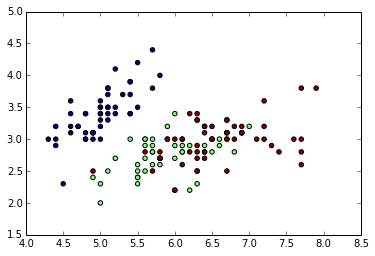

# for Data Science

Twitter: @manjush3

A tutorial on  python for data science.

# Contents
* **Background**
* **Why use Python?**
* **About this tutorial**
* **Aquiring Data**
* **Observing aquired data**
   * Some conclutions
   * Joining data
* **Data Pre-Processing**
   * Extracting useful features
   * Dealing with missing values
* **Data Visualization**
* **Machine Learning Algorithms**
  * Unsupervised
  * Supervised
* **References**

# Background

Python is a high-level programming language that lets you work quickly and
integrate systems more effectively.

### Designed By
* Guido van Rossum

on year 1991

Currently has 3 million+ contributors to the language

Stable release: v3.4.1 (2014-08-01),

# Why Use Python?
* Python is powerful... and fast;
* plays well with others;
* runs everywhere;
* is friendly & easy to learn;
* is Open.

# About this tutorial

Data science is a very powerful subject. It is the science of pulling useful
insights from data. Data science gained lot of popularity in the recent years.
In this tutorial, we will try to explore some of python tools and algorithms
that can help solving data problems.

# Aquiring data

For this tutorial we will try to use publicly available data sets. For initial
illustrations like observing and joining data sets, we will use San Francisco
restaurant data. San Francisco department of public health maintains <a
href="http://www.sfdph.org/dph/EH/Food/score/default.asp">data sets</a> about
restaurants safety scores. Since data is publicly available, aquiring them is
easy. If data is available in a website which do not have any API support, we
can use web scraping techniques. Since there are lot of tutorials on how to get
data, I am skipping that part. For convinience, I added all the requisite data
sets in to the <a href="git repo" > repository </a>. I found Jay-Oh-eN's <a
href="https://github.com/Jay-Oh-eN/happy-healthy-hungry">repository</a> quite
helpful for reference.

# Observing aquired data
In general, there are two kinds of data science problems. First kind could only
be solved if we have domain knowlege about the data sets and the second kind are
those which can be solved by all data scientists without any prior domain
knowledge.
Let's just look at first few rows of data sets, just to know about what kind of
data we are dealing with.

    import pandas as pd
    
    SFbusiness_business = pd.read_csv("data/SFBusinesses/businesses.csv")
    
    SFbusiness_business.head()

<table border="1" class="dataframe">
  <thead>
    <tr style="text-align: right;">
      <th></th>
      <th>business_id</th>
      <th>name</th>
      <th>address</th>
      <th>city</th>
      <th>state</th>
      <th>postal_code</th>
      <th>latitude</th>
      <th>longitude</th>
      <th>phone_number</th>
    </tr>
  </thead>
  <tbody>
    <tr>
      <th>0</th>
      <td> 10</td>
      <td>                   TIRAMISU KITCHEN</td>
      <td>                 033 BELDEN PL</td>
      <td> San Francisco</td>
      <td> CA</td>
      <td> 94104</td>
      <td> 37.791116</td>
      <td>-122.403816</td>
      <td>         NaN</td>
    </tr>
    <tr>
      <th>1</th>
      <td> 12</td>
      <td>                              KIKKA</td>
      <td>          250 EMBARCADERO  7/F</td>
      <td> San Francisco</td>
      <td> CA</td>
      <td> 94105</td>
      <td> 37.788613</td>
      <td>-122.393894</td>
      <td>         NaN</td>
    </tr>
    <tr>
      <th>2</th>
      <td> 17</td>
      <td>               GEORGE'S COFFEE SHOP</td>
      <td>             2200 OAKDALE AVE </td>
      <td> San Francisco</td>
      <td> CA</td>
      <td> 94124</td>
      <td> 37.741086</td>
      <td>-122.401737</td>
      <td> 14155531470</td>
    </tr>
    <tr>
      <th>3</th>
      <td> 19</td>
      <td>              NRGIZE LIFESTYLE CAFE</td>
      <td>  1200 VAN NESS AVE, 3RD FLOOR</td>
      <td> San Francisco</td>
      <td> CA</td>
      <td> 94109</td>
      <td> 37.786848</td>
      <td>-122.421547</td>
      <td>         NaN</td>
    </tr>
    <tr>
      <th>4</th>
      <td> 24</td>
      <td> OMNI S.F. HOTEL - 2ND FLOOR PANTRY</td>
      <td> 500 CALIFORNIA ST, 2ND  FLOOR</td>
      <td> San Francisco</td>
      <td> CA</td>
      <td> 94104</td>
      <td> 37.792888</td>
      <td>-122.403135</td>
      <td>         NaN</td>
    </tr>
  </tbody>
</table>

    SFbusiness_inspections = pd.read_csv("data/SFBusinesses/inspections.csv")
    
    SFbusiness_inspections.head()

<table border="1" class="dataframe">
  <thead>
    <tr style="text-align: right;">
      <th></th>
      <th>business_id</th>
      <th>Score</th>
      <th>date</th>
      <th>type</th>
    </tr>
  </thead>
  <tbody>
    <tr>
      <th>0</th>
      <td> 10</td>
      <td>  98</td>
      <td> 20121114</td>
      <td> routine</td>
    </tr>
    <tr>
      <th>1</th>
      <td> 10</td>
      <td>  98</td>
      <td> 20120403</td>
      <td> routine</td>
    </tr>
    <tr>
      <th>2</th>
      <td> 10</td>
      <td> 100</td>
      <td> 20110928</td>
      <td> routine</td>
    </tr>
    <tr>
      <th>3</th>
      <td> 10</td>
      <td>  96</td>
      <td> 20110428</td>
      <td> routine</td>
    </tr>
    <tr>
      <th>4</th>
      <td> 10</td>
      <td> 100</td>
      <td> 20101210</td>
      <td> routine</td>
    </tr>
  </tbody>
</table>

    SFbusiness_ScoreLegend = pd.read_csv("data/SFBusinesses/ScoreLegend.csv")
    
    SFbusiness_ScoreLegend.head()

<table border="1" class="dataframe">
  <thead>
    <tr style="text-align: right;">
      <th></th>
      <th>Minimum_Score</th>
      <th>Maximum_Score</th>
      <th>Description</th>
    </tr>
  </thead>
  <tbody>
    <tr>
      <th>0</th>
      <td>  0</td>
      <td>  70</td>
      <td>              Poor</td>
    </tr>
    <tr>
      <th>1</th>
      <td> 71</td>
      <td>  85</td>
      <td> Needs Improvement</td>
    </tr>
    <tr>
      <th>2</th>
      <td> 86</td>
      <td>  90</td>
      <td>          Adequate</td>
    </tr>
    <tr>
      <th>3</th>
      <td> 91</td>
      <td> 100</td>
      <td>              Good</td>
    </tr>
  </tbody>
</table>

    SFbusiness_violations = pd.read_csv("data/SFBusinesses/violations.csv")
    
    SFbusiness_violations.head()

<table border="1" class="dataframe">
  <thead>
    <tr style="text-align: right;">
      <th></th>
      <th>business_id</th>
      <th>date</th>
      <th>description</th>
    </tr>
  </thead>
  <tbody>
    <tr>
      <th>0</th>
      <td> 10</td>
      <td> 20121114</td>
      <td> Unclean or degraded floors walls or ceilings  ...</td>
    </tr>
    <tr>
      <th>1</th>
      <td> 10</td>
      <td> 20120403</td>
      <td> Unclean or degraded floors walls or ceilings  ...</td>
    </tr>
    <tr>
      <th>2</th>
      <td> 10</td>
      <td> 20110428</td>
      <td> Inadequate and inaccessible handwashing facili...</td>
    </tr>
    <tr>
      <th>3</th>
      <td> 12</td>
      <td> 20120420</td>
      <td> Food safety certificate or food handler card n...</td>
    </tr>
    <tr>
      <th>4</th>
      <td> 17</td>
      <td> 20120823</td>
      <td> Inadequately cleaned or sanitized food contact...</td>
    </tr>
  </tbody>
</table>

    SFfood_businesses_plus = pd.read_csv("data/SFFoodProgram_Complete_Data/businesses_plus.csv")
    
    SFfood_businesses_plus.head()

<table border="1" class="dataframe">
  <thead>
    <tr style="text-align: right;">
      <th></th>
      <th>business_id</th>
      <th>name</th>
      <th>address</th>
      <th>city</th>
      <th>state</th>
      <th>postal_code</th>
      <th>latitude</th>
      <th>longitude</th>
      <th>phone_no</th>
      <th>TaxCode</th>
      <th>business_certificate</th>
      <th>application_date</th>
      <th>owner_name</th>
      <th>owner_address</th>
      <th>owner_city</th>
      <th>owner_state</th>
      <th>owner_zip</th>
    </tr>
  </thead>
  <tbody>
    <tr>
      <th>0</th>
      <td> 10</td>
      <td>                   TIRAMISU KITCHEN</td>
      <td>                 033 BELDEN PL</td>
      <td> San Francisco</td>
      <td> CA</td>
      <td> 94104</td>
      <td> 37.791116</td>
      <td>-122.403816</td>
      <td>            NaN</td>
      <td> H24</td>
      <td>NaN</td>
      <td>               NaN</td>
      <td>                  Tiramisu LLC</td>
      <td>                 33 Belden St</td>
      <td> San Francisco</td>
      <td> CA</td>
      <td> 94104</td>
    </tr>
    <tr>
      <th>1</th>
      <td> 12</td>
      <td>                              KIKKA</td>
      <td>          250 EMBARCADERO  7/F</td>
      <td> San Francisco</td>
      <td> CA</td>
      <td> 94105</td>
      <td> 37.788613</td>
      <td>-122.393894</td>
      <td>            NaN</td>
      <td> H24</td>
      <td>NaN</td>
      <td> 7/12/2002 0:00:00</td>
      <td>               KIKKA ITO, INC.</td>
      <td>          431 South Isis Ave.</td>
      <td>     Inglewood</td>
      <td> CA</td>
      <td> 90301</td>
    </tr>
    <tr>
      <th>2</th>
      <td> 17</td>
      <td>               GEORGE'S COFFEE SHOP</td>
      <td>             2200 OAKDALE AVE </td>
      <td> San Francisco</td>
      <td> CA</td>
      <td> 94124</td>
      <td> 37.741086</td>
      <td>-122.401737</td>
      <td> (141) 555-5314</td>
      <td> H24</td>
      <td>NaN</td>
      <td>  4/5/1975 0:00:00</td>
      <td>   LIEUW, VICTOR &amp; CHRISTINA C</td>
      <td>          648 MACARTHUR DRIVE</td>
      <td>     DALY CITY</td>
      <td> CA</td>
      <td> 94015</td>
    </tr>
    <tr>
      <th>3</th>
      <td> 19</td>
      <td>              NRGIZE LIFESTYLE CAFE</td>
      <td>  1200 VAN NESS AVE, 3RD FLOOR</td>
      <td> San Francisco</td>
      <td> CA</td>
      <td> 94109</td>
      <td> 37.786848</td>
      <td>-122.421547</td>
      <td>            NaN</td>
      <td> H24</td>
      <td>NaN</td>
      <td>               NaN</td>
      <td>           24 Hour Fitness Inc</td>
      <td> 1200 Van Ness Ave, 3rd Floor</td>
      <td> San Francisco</td>
      <td> CA</td>
      <td> 94109</td>
    </tr>
    <tr>
      <th>4</th>
      <td> 24</td>
      <td> OMNI S.F. HOTEL - 2ND FLOOR PANTRY</td>
      <td> 500 CALIFORNIA ST, 2ND  FLOOR</td>
      <td> San Francisco</td>
      <td> CA</td>
      <td> 94104</td>
      <td> 37.792888</td>
      <td>-122.403135</td>
      <td>            NaN</td>
      <td> H24</td>
      <td>NaN</td>
      <td>               NaN</td>
      <td> OMNI San Francisco Hotel Corp</td>
      <td> 500 California St, 2nd Floor</td>
      <td> San Francisco</td>
      <td> CA</td>
      <td> 94104</td>
    </tr>
  </tbody>
</table>

    SFfood_inspections_plus = pd.read_csv("data/SFFoodProgram_Complete_Data/inspections_plus.csv")
    
    SFfood_businesses_plus.head()

<table border="1" class="dataframe">
  <thead>
    <tr style="text-align: right;">
      <th></th>
      <th>business_id</th>
      <th>name</th>
      <th>address</th>
      <th>city</th>
      <th>state</th>
      <th>postal_code</th>
      <th>latitude</th>
      <th>longitude</th>
      <th>phone_no</th>
      <th>TaxCode</th>
      <th>business_certificate</th>
      <th>application_date</th>
      <th>owner_name</th>
      <th>owner_address</th>
      <th>owner_city</th>
      <th>owner_state</th>
      <th>owner_zip</th>
    </tr>
  </thead>
  <tbody>
    <tr>
      <th>0</th>
      <td> 10</td>
      <td>                   TIRAMISU KITCHEN</td>
      <td>                 033 BELDEN PL</td>
      <td> San Francisco</td>
      <td> CA</td>
      <td> 94104</td>
      <td> 37.791116</td>
      <td>-122.403816</td>
      <td>            NaN</td>
      <td> H24</td>
      <td>NaN</td>
      <td>               NaN</td>
      <td>                  Tiramisu LLC</td>
      <td>                 33 Belden St</td>
      <td> San Francisco</td>
      <td> CA</td>
      <td> 94104</td>
    </tr>
    <tr>
      <th>1</th>
      <td> 12</td>
      <td>                              KIKKA</td>
      <td>          250 EMBARCADERO  7/F</td>
      <td> San Francisco</td>
      <td> CA</td>
      <td> 94105</td>
      <td> 37.788613</td>
      <td>-122.393894</td>
      <td>            NaN</td>
      <td> H24</td>
      <td>NaN</td>
      <td> 7/12/2002 0:00:00</td>
      <td>               KIKKA ITO, INC.</td>
      <td>          431 South Isis Ave.</td>
      <td>     Inglewood</td>
      <td> CA</td>
      <td> 90301</td>
    </tr>
    <tr>
      <th>2</th>
      <td> 17</td>
      <td>               GEORGE'S COFFEE SHOP</td>
      <td>             2200 OAKDALE AVE </td>
      <td> San Francisco</td>
      <td> CA</td>
      <td> 94124</td>
      <td> 37.741086</td>
      <td>-122.401737</td>
      <td> (141) 555-5314</td>
      <td> H24</td>
      <td>NaN</td>
      <td>  4/5/1975 0:00:00</td>
      <td>   LIEUW, VICTOR &amp; CHRISTINA C</td>
      <td>          648 MACARTHUR DRIVE</td>
      <td>     DALY CITY</td>
      <td> CA</td>
      <td> 94015</td>
    </tr>
    <tr>
      <th>3</th>
      <td> 19</td>
      <td>              NRGIZE LIFESTYLE CAFE</td>
      <td>  1200 VAN NESS AVE, 3RD FLOOR</td>
      <td> San Francisco</td>
      <td> CA</td>
      <td> 94109</td>
      <td> 37.786848</td>
      <td>-122.421547</td>
      <td>            NaN</td>
      <td> H24</td>
      <td>NaN</td>
      <td>               NaN</td>
      <td>           24 Hour Fitness Inc</td>
      <td> 1200 Van Ness Ave, 3rd Floor</td>
      <td> San Francisco</td>
      <td> CA</td>
      <td> 94109</td>
    </tr>
    <tr>
      <th>4</th>
      <td> 24</td>
      <td> OMNI S.F. HOTEL - 2ND FLOOR PANTRY</td>
      <td> 500 CALIFORNIA ST, 2ND  FLOOR</td>
      <td> San Francisco</td>
      <td> CA</td>
      <td> 94104</td>
      <td> 37.792888</td>
      <td>-122.403135</td>
      <td>            NaN</td>
      <td> H24</td>
      <td>NaN</td>
      <td>               NaN</td>
      <td> OMNI San Francisco Hotel Corp</td>
      <td> 500 California St, 2nd Floor</td>
      <td> San Francisco</td>
      <td> CA</td>
      <td> 94104</td>
    </tr>
  </tbody>
</table>

    SFfood_violations_plus = pd.read_csv("data/SFFoodProgram_Complete_Data/violations_plus.csv")
    
    SFfood_businesses_plus.head()

<table border="1" class="dataframe">
  <thead>
    <tr style="text-align: right;">
      <th></th>
      <th>business_id</th>
      <th>name</th>
      <th>address</th>
      <th>city</th>
      <th>state</th>
      <th>postal_code</th>
      <th>latitude</th>
      <th>longitude</th>
      <th>phone_no</th>
      <th>TaxCode</th>
      <th>business_certificate</th>
      <th>application_date</th>
      <th>owner_name</th>
      <th>owner_address</th>
      <th>owner_city</th>
      <th>owner_state</th>
      <th>owner_zip</th>
    </tr>
  </thead>
  <tbody>
    <tr>
      <th>0</th>
      <td> 10</td>
      <td>                   TIRAMISU KITCHEN</td>
      <td>                 033 BELDEN PL</td>
      <td> San Francisco</td>
      <td> CA</td>
      <td> 94104</td>
      <td> 37.791116</td>
      <td>-122.403816</td>
      <td>            NaN</td>
      <td> H24</td>
      <td>NaN</td>
      <td>               NaN</td>
      <td>                  Tiramisu LLC</td>
      <td>                 33 Belden St</td>
      <td> San Francisco</td>
      <td> CA</td>
      <td> 94104</td>
    </tr>
    <tr>
      <th>1</th>
      <td> 12</td>
      <td>                              KIKKA</td>
      <td>          250 EMBARCADERO  7/F</td>
      <td> San Francisco</td>
      <td> CA</td>
      <td> 94105</td>
      <td> 37.788613</td>
      <td>-122.393894</td>
      <td>            NaN</td>
      <td> H24</td>
      <td>NaN</td>
      <td> 7/12/2002 0:00:00</td>
      <td>               KIKKA ITO, INC.</td>
      <td>          431 South Isis Ave.</td>
      <td>     Inglewood</td>
      <td> CA</td>
      <td> 90301</td>
    </tr>
    <tr>
      <th>2</th>
      <td> 17</td>
      <td>               GEORGE'S COFFEE SHOP</td>
      <td>             2200 OAKDALE AVE </td>
      <td> San Francisco</td>
      <td> CA</td>
      <td> 94124</td>
      <td> 37.741086</td>
      <td>-122.401737</td>
      <td> (141) 555-5314</td>
      <td> H24</td>
      <td>NaN</td>
      <td>  4/5/1975 0:00:00</td>
      <td>   LIEUW, VICTOR &amp; CHRISTINA C</td>
      <td>          648 MACARTHUR DRIVE</td>
      <td>     DALY CITY</td>
      <td> CA</td>
      <td> 94015</td>
    </tr>
    <tr>
      <th>3</th>
      <td> 19</td>
      <td>              NRGIZE LIFESTYLE CAFE</td>
      <td>  1200 VAN NESS AVE, 3RD FLOOR</td>
      <td> San Francisco</td>
      <td> CA</td>
      <td> 94109</td>
      <td> 37.786848</td>
      <td>-122.421547</td>
      <td>            NaN</td>
      <td> H24</td>
      <td>NaN</td>
      <td>               NaN</td>
      <td>           24 Hour Fitness Inc</td>
      <td> 1200 Van Ness Ave, 3rd Floor</td>
      <td> San Francisco</td>
      <td> CA</td>
      <td> 94109</td>
    </tr>
    <tr>
      <th>4</th>
      <td> 24</td>
      <td> OMNI S.F. HOTEL - 2ND FLOOR PANTRY</td>
      <td> 500 CALIFORNIA ST, 2ND  FLOOR</td>
      <td> San Francisco</td>
      <td> CA</td>
      <td> 94104</td>
      <td> 37.792888</td>
      <td>-122.403135</td>
      <td>            NaN</td>
      <td> H24</td>
      <td>NaN</td>
      <td>               NaN</td>
      <td> OMNI San Francisco Hotel Corp</td>
      <td> 500 California St, 2nd Floor</td>
      <td> San Francisco</td>
      <td> CA</td>
      <td> 94104</td>
    </tr>
  </tbody>
</table>

    # A simple way to find out how many rows are present and what columbs consist of numerical data , we can use describe()
    
    SFfood_businesses_plus.describe()

<table border="1" class="dataframe">
  <thead>
    <tr style="text-align: right;">
      <th></th>
      <th>business_id</th>
      <th>latitude</th>
      <th>longitude</th>
      <th>business_certificate</th>
    </tr>
  </thead>
  <tbody>
    <tr>
      <th>count</th>
      <td>  6352.000000</td>
      <td> 5495.000000</td>
      <td> 5495.000000</td>
      <td>    1131.000000</td>
    </tr>
    <tr>
      <th>mean</th>
      <td> 32944.535894</td>
      <td>   37.525775</td>
      <td> -121.622553</td>
      <td>  449157.537577</td>
    </tr>
    <tr>
      <th>std</th>
      <td> 28884.685537</td>
      <td>    3.047733</td>
      <td>    9.877572</td>
      <td>  159777.164993</td>
    </tr>
    <tr>
      <th>min</th>
      <td>    10.000000</td>
      <td>    0.000000</td>
      <td> -122.510896</td>
      <td>    4965.000000</td>
    </tr>
    <tr>
      <th>25%</th>
      <td>  4138.500000</td>
      <td>   37.760272</td>
      <td> -122.435457</td>
      <td>  446211.000000</td>
    </tr>
    <tr>
      <th>50%</th>
      <td> 28534.500000</td>
      <td>   37.780568</td>
      <td> -122.418129</td>
      <td>  465714.000000</td>
    </tr>
    <tr>
      <th>75%</th>
      <td> 65468.500000</td>
      <td>   37.789875</td>
      <td> -122.405568</td>
      <td>  471461.000000</td>
    </tr>
    <tr>
      <th>max</th>
      <td> 74591.000000</td>
      <td>   37.875937</td>
      <td>    0.000000</td>
      <td> 4222215.000000</td>
    </tr>
  </tbody>
</table>

    SFfood_businesses_plus.count() #NaN values are ignored

    business_id             6352
    name                    6352
    address                 6350
    city                    6352
    state                   6352
    postal_code             6121
    latitude                5495
    longitude               5495
    phone_no                1461
    TaxCode                 6352
    business_certificate    1131
    application_date        4481
    owner_name              6342
    owner_address           6331
    owner_city              6263
    owner_state             6262
    owner_zip               6244
    dtype: int64

# Some conclutions
* **Some of data sheets are quite similar to other data sheets.**
* **NaN signifies null values.**
* **When we look in to these data sets, we find that only some features of data
are useful while others are supposed to be filtered.**
* **We need more analysis about how many columns a particular data sheet
consist.Then we will try to join the data sheets.**
* **Data fields that matters are
business_id,name,address,latitude,longitude,scores,date which are present in
businesses and inspection data sheets. Remaining data fields are either repeated
or not required for data problems.**
* **Almost every data set consist of business_id as a primary key, we could
utilize it for joining data sheets.**

# Joining data

    '''pandas data frames uses left outer join, therefore all records of SFbusiness_business will be preset
       even though corresponding rows are not present on SFbusiness_inspection '''
    
    print SFbusiness_business.columns
    
    print SFbusiness_inspections.columns
    
    main_table = SFbusiness_business.merge( SFbusiness_inspections, on='business_id' )
    
    print main_table.columns

    Index([u'business_id', u'name', u'address', u'city', u'state', u'postal_code', u'latitude', u'longitude', u'phone_number'], dtype='object')
    Index([u'business_id', u'Score', u'date', u'type'], dtype='object')
    Index([u'business_id', u'name', u'address', u'city', u'state', u'postal_code', u'latitude', u'longitude', u'phone_number', u'Score', u'date', u'type'], dtype='object')

    # let's just look at few rows of our main_table
    
    main_table.head(10)
    

<table border="1" class="dataframe">
  <thead>
    <tr style="text-align: right;">
      <th></th>
      <th>business_id</th>
      <th>name</th>
      <th>address</th>
      <th>city</th>
      <th>state</th>
      <th>postal_code</th>
      <th>latitude</th>
      <th>longitude</th>
      <th>phone_number</th>
      <th>Score</th>
      <th>date</th>
      <th>type</th>
    </tr>
  </thead>
  <tbody>
    <tr>
      <th>0</th>
      <td> 10</td>
      <td>     TIRAMISU KITCHEN</td>
      <td>        033 BELDEN PL</td>
      <td> San Francisco</td>
      <td> CA</td>
      <td> 94104</td>
      <td> 37.791116</td>
      <td>-122.403816</td>
      <td>         NaN</td>
      <td>  98</td>
      <td> 20121114</td>
      <td> routine</td>
    </tr>
    <tr>
      <th>1</th>
      <td> 10</td>
      <td>     TIRAMISU KITCHEN</td>
      <td>        033 BELDEN PL</td>
      <td> San Francisco</td>
      <td> CA</td>
      <td> 94104</td>
      <td> 37.791116</td>
      <td>-122.403816</td>
      <td>         NaN</td>
      <td>  98</td>
      <td> 20120403</td>
      <td> routine</td>
    </tr>
    <tr>
      <th>2</th>
      <td> 10</td>
      <td>     TIRAMISU KITCHEN</td>
      <td>        033 BELDEN PL</td>
      <td> San Francisco</td>
      <td> CA</td>
      <td> 94104</td>
      <td> 37.791116</td>
      <td>-122.403816</td>
      <td>         NaN</td>
      <td> 100</td>
      <td> 20110928</td>
      <td> routine</td>
    </tr>
    <tr>
      <th>3</th>
      <td> 10</td>
      <td>     TIRAMISU KITCHEN</td>
      <td>        033 BELDEN PL</td>
      <td> San Francisco</td>
      <td> CA</td>
      <td> 94104</td>
      <td> 37.791116</td>
      <td>-122.403816</td>
      <td>         NaN</td>
      <td>  96</td>
      <td> 20110428</td>
      <td> routine</td>
    </tr>
    <tr>
      <th>4</th>
      <td> 10</td>
      <td>     TIRAMISU KITCHEN</td>
      <td>        033 BELDEN PL</td>
      <td> San Francisco</td>
      <td> CA</td>
      <td> 94104</td>
      <td> 37.791116</td>
      <td>-122.403816</td>
      <td>         NaN</td>
      <td> 100</td>
      <td> 20101210</td>
      <td> routine</td>
    </tr>
    <tr>
      <th>5</th>
      <td> 12</td>
      <td>                KIKKA</td>
      <td> 250 EMBARCADERO  7/F</td>
      <td> San Francisco</td>
      <td> CA</td>
      <td> 94105</td>
      <td> 37.788613</td>
      <td>-122.393894</td>
      <td>         NaN</td>
      <td> 100</td>
      <td> 20121120</td>
      <td> routine</td>
    </tr>
    <tr>
      <th>6</th>
      <td> 12</td>
      <td>                KIKKA</td>
      <td> 250 EMBARCADERO  7/F</td>
      <td> San Francisco</td>
      <td> CA</td>
      <td> 94105</td>
      <td> 37.788613</td>
      <td>-122.393894</td>
      <td>         NaN</td>
      <td>  98</td>
      <td> 20120420</td>
      <td> routine</td>
    </tr>
    <tr>
      <th>7</th>
      <td> 12</td>
      <td>                KIKKA</td>
      <td> 250 EMBARCADERO  7/F</td>
      <td> San Francisco</td>
      <td> CA</td>
      <td> 94105</td>
      <td> 37.788613</td>
      <td>-122.393894</td>
      <td>         NaN</td>
      <td> 100</td>
      <td> 20111018</td>
      <td> routine</td>
    </tr>
    <tr>
      <th>8</th>
      <td> 12</td>
      <td>                KIKKA</td>
      <td> 250 EMBARCADERO  7/F</td>
      <td> San Francisco</td>
      <td> CA</td>
      <td> 94105</td>
      <td> 37.788613</td>
      <td>-122.393894</td>
      <td>         NaN</td>
      <td> 100</td>
      <td> 20110401</td>
      <td> routine</td>
    </tr>
    <tr>
      <th>9</th>
      <td> 17</td>
      <td> GEORGE'S COFFEE SHOP</td>
      <td>    2200 OAKDALE AVE </td>
      <td> San Francisco</td>
      <td> CA</td>
      <td> 94124</td>
      <td> 37.741086</td>
      <td>-122.401737</td>
      <td> 14155531470</td>
      <td> 100</td>
      <td> 20120823</td>
      <td> routine</td>
    </tr>
  </tbody>
</table>

# Data Pre-Processing

Data is often found in a difficult to use manner. To imporve the accuracy, pre-
processing is essential. We are using Biostatistics data from VANDERBILT
UNIVERSITY for data pre-processing. You can find the data set <a href="http://bi
ostat.mc.vanderbilt.edu/wiki/Main/DataSets?CGISESSID=10713f6d891653ddcbb7ddbdd9c
ffb79">here</a>. For convinience I included it in the git repository.

 # Extracting useful features
 Let's assume that we wanted to know how death of patient is dependent on
age,sex,race,income. We are not interested in remaining features of the data
set. Therefore we will make a pandas frame which serves our purpose.

    data1 = pd.read_csv("data/support2.csv")
    #Creating pandas data frame which that holds only few features about data such as age,sex,race,income and death(dead=1 | alive=0)
    med = pd.DataFrame( {'age':data1['age'],
                       'death':data1['death'],
                        'sex':data1['sex'],
                        'race': data1['race'],
                        'income': data1['income'],
                         })
    med.head(10)

<table border="1" class="dataframe">
  <thead>
    <tr style="text-align: right;">
      <th></th>
      <th>age</th>
      <th>death</th>
      <th>income</th>
      <th>race</th>
      <th>sex</th>
    </tr>
  </thead>
  <tbody>
    <tr>
      <th>0</th>
      <td> 62.84998</td>
      <td> 0</td>
      <td>   $11-$25k</td>
      <td>    other</td>
      <td>   male</td>
    </tr>
    <tr>
      <th>1</th>
      <td> 60.33899</td>
      <td> 1</td>
      <td>   $11-$25k</td>
      <td>    white</td>
      <td> female</td>
    </tr>
    <tr>
      <th>2</th>
      <td> 52.74698</td>
      <td> 1</td>
      <td> under $11k</td>
      <td>    white</td>
      <td> female</td>
    </tr>
    <tr>
      <th>3</th>
      <td> 42.38498</td>
      <td> 1</td>
      <td> under $11k</td>
      <td>    white</td>
      <td> female</td>
    </tr>
    <tr>
      <th>4</th>
      <td> 79.88495</td>
      <td> 0</td>
      <td>        NaN</td>
      <td>    white</td>
      <td> female</td>
    </tr>
    <tr>
      <th>5</th>
      <td> 93.01599</td>
      <td> 1</td>
      <td>        NaN</td>
      <td>    white</td>
      <td>   male</td>
    </tr>
    <tr>
      <th>6</th>
      <td> 62.37097</td>
      <td> 1</td>
      <td>   $25-$50k</td>
      <td>    white</td>
      <td>   male</td>
    </tr>
    <tr>
      <th>7</th>
      <td> 86.83899</td>
      <td> 1</td>
      <td>        NaN</td>
      <td>    white</td>
      <td>   male</td>
    </tr>
    <tr>
      <th>8</th>
      <td> 85.65594</td>
      <td> 1</td>
      <td>        NaN</td>
      <td>    black</td>
      <td>   male</td>
    </tr>
    <tr>
      <th>9</th>
      <td> 42.25897</td>
      <td> 1</td>
      <td>   $25-$50k</td>
      <td> hispanic</td>
      <td> female</td>
    </tr>
  </tbody>
</table>

# Dealing with missing values
Most common pre-processing step is to deal with missing values. Pandas data
frames automaticlly takes null values to be NaN. We can ignore those values or
replace with '0'. Filling null values with appropriate central tendencies such
as median, mean, mode is considered as a better practice. For this purpose,
Series data structure could be useful. A Series is a one-dimensional array-like
object.

    from pandas import Series
    seriesresult = Series(x for x in med['income'])
    #replacing $11-$25k with 18
    seriesresult=seriesresult.replace(to_replace='$11-$25k', value='18')
    #replacing under $11 to 5.5
    seriesresult=seriesresult.replace(to_replace='under $11k', value='5.5')
    #replacing $25k-50k with 37.5
    seriesresult=seriesresult.replace(to_replace='$25-$50k', value='37.5')
    #replacing >$50k with 75
    seriesresult=seriesresult.replace(to_replace='>$50k', value='75')
    print seriesresult

    0       18
    1       18
    2      5.5
    3      5.5
    4      NaN
    5      NaN
    6     37.5
    7      NaN
    8      NaN
    9     37.5
    10     NaN
    11     NaN
    12      18
    13      18
    14     NaN
    ...
    9090      18
    9091     5.5
    9092     NaN
    9093    37.5
    9094     NaN
    9095     NaN
    9096      18
    9097      18
    9098     NaN
    9099     5.5
    9100     NaN
    9101     NaN
    9102     NaN
    9103     NaN
    9104      18
    Length: 9105, dtype: object

    # Checking for null values
    print "\nCSV Value isnull: " + str(seriesresult.isnull())
    # Ignoring null values
    print "\nCSV Value dropna: " + str(seriesresult.dropna())
    # Replacing with '0'
    print "\nCSV Value fillna(0): " + str(seriesresult.fillna(0))

    
    CSV Value isnull: 0     False
    1     False
    2     False
    3     False
    4      True
    5      True
    6     False
    7      True
    8      True
    9     False
    10     True
    11     True
    12    False
    13    False
    14     True
    ...
    9090    False
    9091    False
    9092     True
    9093    False
    9094     True
    9095     True
    9096    False
    9097    False
    9098     True
    9099    False
    9100     True
    9101     True
    9102     True
    9103     True
    9104    False
    Length: 9105, dtype: bool
    
    CSV Value dropna: 0       18
    1       18
    2      5.5
    3      5.5
    6     37.5
    9     37.5
    12      18
    13      18
    15      75
    17    37.5
    18     5.5
    19      18
    20      75
    22    37.5
    23    37.5
    ...
    9079    37.5
    9080     5.5
    9081    37.5
    9083     5.5
    9085      75
    9086      18
    9087      18
    9088      18
    9090      18
    9091     5.5
    9093    37.5
    9096      18
    9097      18
    9099     5.5
    9104      18
    Length: 6123, dtype: object
    
    CSV Value fillna(0): 0       18
    1       18
    2      5.5
    3      5.5
    4        0
    5        0
    6     37.5
    7        0
    8        0
    9     37.5
    10       0
    11       0
    12      18
    13      18
    14       0
    ...
    9090      18
    9091     5.5
    9092       0
    9093    37.5
    9094       0
    9095       0
    9096      18
    9097      18
    9098       0
    9099     5.5
    9100       0
    9101       0
    9102       0
    9103       0
    9104      18
    Length: 9105, dtype: object

Since, we are dealing with ordinal data, we could replace it with median.

    l= str(seriesresult.median())
    print "\nmedian: " + l
    k = float(l)
    print k
    #replacing with median
    print "\nCSV Value fillna(0): " + str(seriesresult.fillna(k))

    
    median: 18.0
    18.0
    
    CSV Value fillna(0): 0       18
    1       18
    2      5.5
    3      5.5
    4       18
    5       18
    6     37.5
    7       18
    8       18
    9     37.5
    10      18
    11      18
    12      18
    13      18
    14      18
    ...
    9090      18
    9091     5.5
    9092      18
    9093    37.5
    9094      18
    9095      18
    9096      18
    9097      18
    9098      18
    9099     5.5
    9100      18
    9101      18
    9102      18
    9103      18
    9104      18
    Length: 9105, dtype: object

There are better ways to replace missing values. One of the ways is to use
linear regression. We will try to fit the model with a linear equation. There is
a column called charges mentioning mediacal bills. Let's see if charges and
income have any trend togather.

    ourfocus = pd.DataFrame({'income':data1['income'],
                             'charges':data1['charges']})
    ourfocus['income']=seriesresult # putting result of seriesresult in place of ourfocus income column
    ourfocus.head(10)

<table border="1" class="dataframe">
  <thead>
    <tr style="text-align: right;">
      <th></th>
      <th>charges</th>
      <th>income</th>
    </tr>
  </thead>
  <tbody>
    <tr>
      <th>0</th>
      <td>  9715</td>
      <td>   18</td>
    </tr>
    <tr>
      <th>1</th>
      <td> 34496</td>
      <td>   18</td>
    </tr>
    <tr>
      <th>2</th>
      <td> 41094</td>
      <td>  5.5</td>
    </tr>
    <tr>
      <th>3</th>
      <td>  3075</td>
      <td>  5.5</td>
    </tr>
    <tr>
      <th>4</th>
      <td> 50127</td>
      <td>  NaN</td>
    </tr>
    <tr>
      <th>5</th>
      <td>  6884</td>
      <td>  NaN</td>
    </tr>
    <tr>
      <th>6</th>
      <td> 30460</td>
      <td> 37.5</td>
    </tr>
    <tr>
      <th>7</th>
      <td> 30460</td>
      <td>  NaN</td>
    </tr>
    <tr>
      <th>8</th>
      <td>   NaN</td>
      <td>  NaN</td>
    </tr>
    <tr>
      <th>9</th>
      <td>  9914</td>
      <td> 37.5</td>
    </tr>
  </tbody>
</table>

We should remove all the missing values here since we are trying to see
correlation between charge and income.

    import numpy as np
    ourfocus = ourfocus.dropna().reset_index()
    new = pd.DataFrame({'charges':ourfocus['charges'],
                        'income':ourfocus['income']})
    #converting all the values of the data frame in to floats
    new=new.applymap(lambda x:float(x))
    #print ourfocus['charges'].mean
    #print ourfocus['income'].mean
    print new.head(10)
    new.corr()

       charges  income
    0     9715    18.0
    1    34496    18.0
    2    41094     5.5
    3     3075     5.5
    4    30460    37.5
    5     9914    37.5
    6     4353    18.0
    7    19783    18.0
    8    10758    75.0
    9   283303    37.5

<table border="1" class="dataframe">
  <thead>
    <tr style="text-align: right;">
      <th></th>
      <th>charges</th>
      <th>income</th>
    </tr>
  </thead>
  <tbody>
    <tr>
      <th>charges</th>
      <td> 1.0000</td>
      <td> 0.1237</td>
    </tr>
    <tr>
      <th>income</th>
      <td> 0.1237</td>
      <td> 1.0000</td>
    </tr>
  </tbody>
</table>

0.1237 means very sligt correlation exits between income and charges. So, now we
know from above that we can't use charges to fill the missing values of income.

# Data Visualization

I am using bokeh charts to show visualizations. You can find more about it <a
href="http://bokeh.pydata.org/">here</a>

    #Scatter Plot
    from collections import OrderedDict
    from bokeh.charts import Scatter
    
    data2 = data1.head(200) #copying first 200 to different data frame
    
    data2['d.time'] = data2['d.time'].map(lambda x:x/365.0 ) # converting days in to years by diviing all values by 365
    
    male = data2[(data2.sex == "male")][["age", "d.time"]]  
    
    female = data2[(data2.sex == "female")][["age", "d.time"]] 
    
    xyvalues = OrderedDict([("male", male.values), ("female", female.values)]) # using OrderedDict 
    
    scatter = Scatter(xyvalues, filename = "plots/scatter.html") 
    #scatter.notebook().show()
    #output_notebook
    #plot = scatter
    scatter.title("Scatter Plot").xlabel("Age in years").ylabel("Years spent on hospitals").legend("top_left").width(600).height(400).show()
    from IPython.display import HTML
    HTML('<iframe src=plots/scatter.html width=700 height=500></iframe>')

    Wrote plots/scatter.html

<iframe src=plots/scatter.html width=700 height=500></iframe>

    # Bar Graph
    import pandas as pd
    
    # let's constuct an anology on how many are hospital dead in dead for each race of people in bar chart
    data2 = pd.DataFrame({'race': data1['race'],'normaldeath': data1['death'] ,'hospdead': data1['hospdead']})
    dead = data2[data2['normaldeath']==1].groupby('race').count()
    hospdead = data2[data2['hospdead']==1].groupby('race').count()
    dead['normaldeath'] = dead['normaldeath'] - hospdead['hospdead']
    dead['hospdead'] = hospdead['hospdead']
    print dead
    from bokeh.charts import Bar
    bar = Bar(dead, filename="plots/bar1.html")
    bar.title("Stacked Bar Graph").xlabel("Race").ylabel("Total number of people dead") .legend("top_left").width(600).height(700).stacked().show()
    from IPython.display import HTML
    HTML('<iframe src=plots/bar1.html width=700 height=800></iframe>')

              hospdead  normaldeath
    race                           
    asian           30           28
    black          383          526
    hispanic        68          105
    other           37           44
    white         1823         3125
    Wrote plots/bar1.html

<iframe src=plots/bar1.html width=700 height=800></iframe>

# Machine Learning Algorithms

### Unsupervised Learning

                Kmeans clustering is easy to appy but it is very powerful in terms of output. we start by generating some artificial data. 
                

    # kmeans Clustering
    import matplotlib.pyplot as plt
    %matplotlib inline
    plt.jet() # set the color map. When your colors are lost, re-run this.
    import sklearn.datasets as datasets
    X, Y = datasets.make_blobs(centers=6, cluster_std=0.5, random_state=0) #random data sets with 3 centers with std deviation of 0.5

    <matplotlib.figure.Figure at 0x581bb90>

    plt.scatter(X[:,0], X[:,1]);
    plt.show()

    from sklearn.cluster import KMeans
    kmeans = KMeans(3, random_state=8)
    Y_hat = kmeans.fit(X).labels_

    plt.scatter(X[:,0], X[:,1], c=Y_hat);
    plt.show()

    plt.scatter(X[:,0], X[:,1], c=Y_hat, alpha=0.4)
    mu = kmeans.cluster_centers_
    plt.scatter(mu[:,0], mu[:,1], s=100, c=np.unique(Y_hat))
    plt.show()
    print mu

    [[-1.23211442  8.04092475]
     [ 7.53975776 -0.94980578]
     [ 0.47403713  2.77387221]]

    data3 = data1.head(200)
    #print data3
    plt.scatter(data3['age'], data3['d.time']);
    plt.show()

    # PCA demonstation on iris data set
    from sklearn.decomposition import PCA
    from sklearn.datasets import load_iris
    iris = load_iris()
    pca = PCA(n_components=2, whiten=True).fit(iris.data)
    X_pca = pca.transform(iris.data)
    plt.scatter(X_pca[:, 0], X_pca[:, 1], c=iris.target)
    formatter = plt.FuncFormatter(lambda i, *args: iris.target_names[int(i)])
    plt.colorbar(ticks=[0, 1, 2], format=formatter)
    var_explained = pca.explained_variance_ratio_ * 100
    plt.xlabel('First Component: {0:.1f}%'.format(var_explained[0]))
    plt.ylabel('Second Component: {0:.1f}%'.format(var_explained[1]))

    <matplotlib.text.Text at 0x6580310>

It is not necessary that you are doing something good by applying PCA to your
data. There are more chances of losing accuracy than gaining by applying PCA to
your data.

### Supervised Learning - Regression

    # Linear Regression
    from sklearn import linear_model
    import matplotlib.pyplot as plt
    from sklearn.cross_validation import train_test_split
    houses = datasets.load_boston()
    houses_X = houses.data[:, np.newaxis]
    houses_X_temp = houses_X[:, :, 2]
    X_train, X_test, Y_train, Y_test = train_test_split(houses_X_temp, houses.target, test_size=0.45)
    lreg = linear_model.LinearRegression()
    lreg.fit(X_train, Y_train)
    plt.scatter(X_test, Y_test, color='black')
    plt.plot(X_test, lreg.predict(X_test), color='red', linewidth=3)
    plt.show()

    # Decision boundry regression
    import numpy as np
    import matplotlib.pyplot as plt
    from sklearn import linear_model, datasets
    
    # Let's write a estimator for convience so that we could reuse it.
    def plot_estimator(estimator, X, Y):
     estimator.fit(X, Y)
     # Plot the decision boundary. For that, we will assign a color to each
     # point in the mesh [x_min, m_max]x[y_min, y_max].   
     x_min, x_max = X[:, 0].min() -0.5, X[:, 0].max()+0.5
     y_min, y_max = X[:, 1].min()-0.5 , X[:, 1].max()+0.5
     xx, yy = np.meshgrid(np.linspace(x_min, x_max, 100),np.linspace(y_min, y_max, 100))
     Z = estimator.predict(np.c_[xx.ravel(), yy.ravel()])
     # Put the result into a color map
     Z = Z.reshape(xx.shape)
     plt.figure()
     plt.xlabel('Sepal length')
     plt.ylabel('Sepal width')
     plt.xlim(xx.min(), xx.max())
     plt.ylim(yy.min(), yy.max())
     plt.xticks(())
     plt.yticks(())
     plt.pcolormesh(xx, yy, Z, alpha=0.2,cmap='rainbow')
     plt.scatter(X[:, 0], X[:, 1], c=Y, s=20 )
    
    
    # import some data to play with
    iris = datasets.load_iris()
    X = iris.data[:, :2]  # we only take the first two features.
    Y = iris.target
    
    logreg = linear_model.LogisticRegression(C=1e5)
    
    # we create an instance of Neighbours Classifier and fit the data.
    logreg.fit(X, Y)
    
    plot_estimator(logreg,X,Y)

### Supervised Learning - Classification

    from sklearn.datasets.samples_generator import make_blobs
    X, Y = make_blobs(n_samples=200, centers=2,
                      random_state=0, cluster_std=0.60)
    
    plt.scatter(X[:, 0], X[:, 1], c=Y, s=20);

    from sklearn.svm import SVC # "Support Vector"
    clf = SVC(kernel='linear')
    clf.fit(X, Y)

    SVC(C=1.0, cache_size=200, class_weight=None, coef0=0.0, degree=3, gamma=0.0,
      kernel='linear', max_iter=-1, probability=False, random_state=None,
      shrinking=True, tol=0.001, verbose=False)

    plt.scatter(X[:, 0], X[:, 1], c=Y, s=20)
    x = np.linspace(plt.xlim()[0], plt.xlim()[1], 30)
    y = np.linspace(plt.ylim()[0], plt.ylim()[1], 30)
    Y, X = np.meshgrid(y, x)
    P = np.zeros_like(X)
    for i, xi in enumerate(x):
     for j, yj in enumerate(y):
      P[i, j] = clf.decision_function([xi, yj])
    plt.contour(X, Y, P, colors='k',levels=[-1, 0, 1],linestyles=['--', '-', '--'])

    <matplotlib.contour.QuadContourSet instance at 0x675c248>

    # Decision tree classifier
    from sklearn.tree import DecisionTreeClassifier
    #X, Y = make_blobs(n_samples=500, centers=3,random_state=0, cluster_std=0.60)
    X = iris.data[:, :2]  # we only take the first two features.
    Y = iris.target
    plt.scatter(X[:, 0], X[:, 1], c=Y, s=20)

    <matplotlib.collections.PathCollection at 0x688f390>

    clf = DecisionTreeClassifier(max_depth=10)
    plot_estimator(clf, X, Y) # function call to plot_estimator

Decision trees tend to over fitting of data. Most of the models face the same
problems. Better approach is to use a different kind of decision tree called
random forest.

    # Random forests
    from sklearn.ensemble import RandomForestClassifier
    clf = RandomForestClassifier(n_estimators=10, random_state=0)
    plot_estimator(clf, X, Y) # function call to plot estimator

# References

* scikit-learn <a href="http://scikit-learn.org/stable/">main page</a>
* A <a href="https://github.com/ipython/ipython/wiki/A-gallery-of-interesting-
IPython-Notebooks">gallery </a>of interesting IPython Notebooks
* Jay-Oh-eN git <a href="https://github.com/Jay-Oh-eN/happy-healthy-
hungry">repository</a>
* Jakevdp git <a href="https://github.com/jakevdp/sklearn_pycon2014/tree/master/
notebooks">repository</a>, sklearn pycon2014
* Open <a href="http://learnds.com/">content</a> for self-directed learning in
data science
* Financial data analysis git <a href="https://github.com/twiecki/financial-
analysis-python-tutorial">repository</a>

